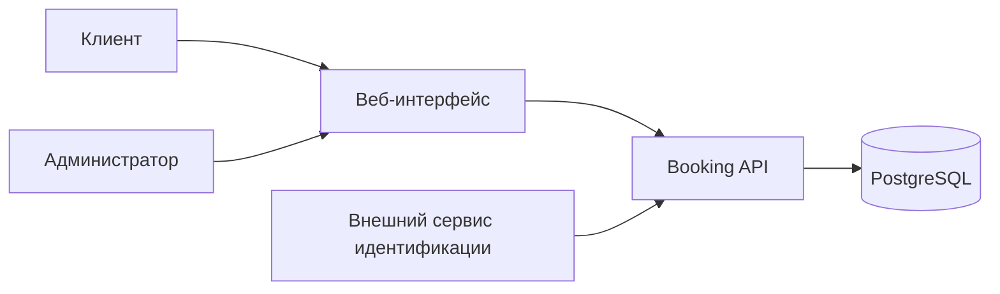
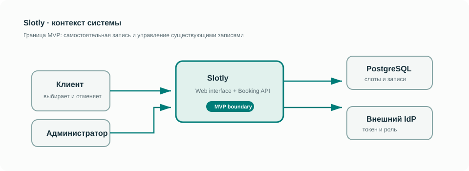
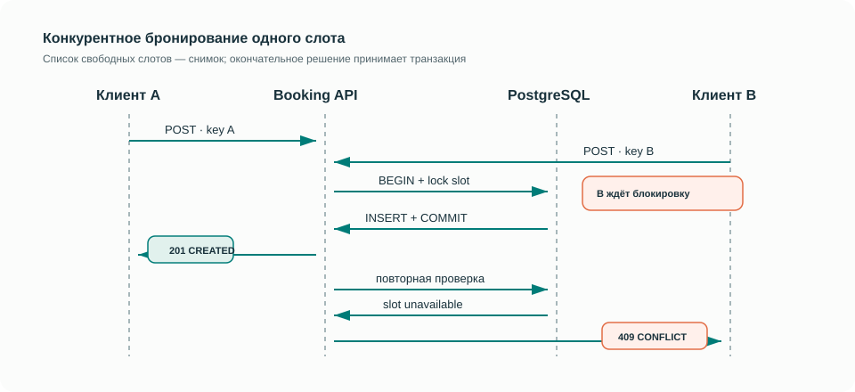
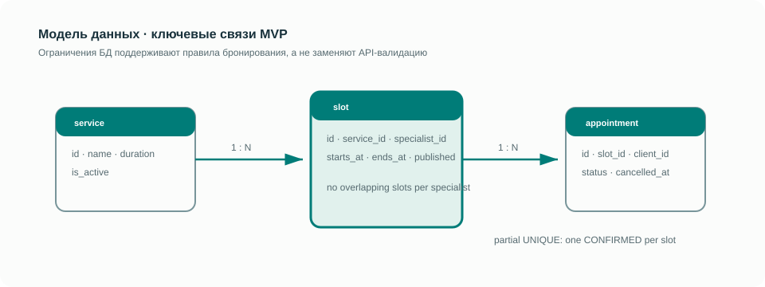

# Slotly — система онлайн-записи на услуги

**Аналитическая спецификация системы онлайн-записи.**

Кейс небольшой студии: клиент выбирает услугу и свободное время, получает подтверждение и может отменить запись. Главный вопрос проекта — как гарантировать, что один слот не достанется двум клиентам, даже если они нажали «Записаться» одновременно.

В основе кейса — смоделированные процессы небольшой студии. Результат работы — спецификация MVP: от постановки задачи до контракта API и критериев приёмки.

> Начать с краткого обзора: [кейс системного аналитика](docs/00-case-study.md). Он показывает проблему, ключевое решение и путь до проверки за несколько минут.

## Навигация

1. [Кейс системного аналитика](docs/00-case-study.md): проблема, решение, проверяемость.
2. [Задача, границы и заинтересованные стороны](docs/01-business-context.md).
3. [Требования и правила](docs/02-requirements.md) → [сценарии использования](docs/03-use-cases.md).
4. [Процессы, UML и состояния](docs/04-processes-and-uml.md).
5. [Модель данных](docs/05-data-model.md) → [контракт API](api/openapi.json).
6. [Приёмка](docs/07-acceptance.md) → [матрица трассировки](docs/08-traceability-matrix.md).

Отдельные диаграммы: [High-Level Architecture](diagrams/high-level-architecture.md) · [BPMN бизнес-процессы](diagrams/business-processes.md) · [UML Sequence Diagrams](diagrams/uml-sequence-diagrams.md).

## Артефакты

| Область | Содержание |
|---|---|
| Постановка задачи и управление границами | Контекст, MVP, допущения, вопросы заказчику |
| Формализация требований | FR/NFR, бизнес-правила, роли и права |
| Архитектура и процессы | High-Level Architecture, AS-IS / TO-BE, BPMN 2.0 |
| Описание взаимодействия систем | UML sequence, REST API, ошибки и идемпотентность |
| Проектирование данных | ER-диаграмма, словарь, PostgreSQL DDL |
| Проверяемость требований | Критерии приёмки, негативные и граничные сценарии, матрица трассировки |
| Обоснование решений | ADR о слотах и политике идемпотентности |



## Архитектура за один экран

<p align="center">
  
</p>

<p align="center">
  
</p>

<p align="center">
  
</p>

Исходные редактируемые диаграммы и полная логика решения находятся в каталоге [diagrams](diagrams/) и документе [Процессы и UML](docs/04-processes-and-uml.md).

## Состав репозитория

```text
docs/       Контекст, требования, сценарии, модели, API-пояснения, приёмка
diagrams/   BPMN 2.0 с координатами для редактора
api/        OpenAPI 3.0.3 в JSON и примеры HTTP-запросов
database/   PostgreSQL DDL и запросы аналитика
decisions/  Обоснование ключевого проектного решения
tools/      Проверка внутренних ссылок и структуры API
```

## Как изучать и проверять

- Документы и Mermaid-диаграммы читаются прямо в GitHub.
- `diagrams/high-level-architecture.md`, `diagrams/business-processes.md` и `diagrams/uml-sequence-diagrams.md` содержат диаграммы Mermaid и читаются прямо в GitHub.
- `diagrams/booking.bpmn` можно открыть в редакторе BPMN 2.0. Это процесс оркестрации запроса, не исполняемая конфигурация движка.
- `api/openapi.json` можно импортировать в Swagger Editor или Postman. Адрес `https://api.slotly.example/v1` — демонстрационный, сервер не развёрнут.
- `database/schema.sql` описывает модель PostgreSQL; это проект DDL, а не миграция существующей системы.
- Проверка без внешних зависимостей: `node tools/validate.mjs`.

## Ключевые решения

MVP использует заранее созданные слоты фиксированной длительности. Один слот связан с одной услугой и одним специалистом. База запрещает пересечение слотов специалиста и более одной активной записи на слот. Отмена освобождает слот в той же транзакции. Повтор успешного запроса с тем же ключом не создаёт дубль.

Подробности и ограничения: [ADR-001](decisions/001-fixed-slots.md) и [ADR-002](decisions/002-idempotency-result.md). Не входят в MVP: оплата, перенос одним действием, SMS, групповые услуги, управление расписанием через API и регистрация пользователей.

## Статус

Спецификация v1.0. Объём проекта ограничен системным анализом и проектированием. API не развёрнут; приёмочные и нагрузочные испытания относятся к следующему этапу реализации.
