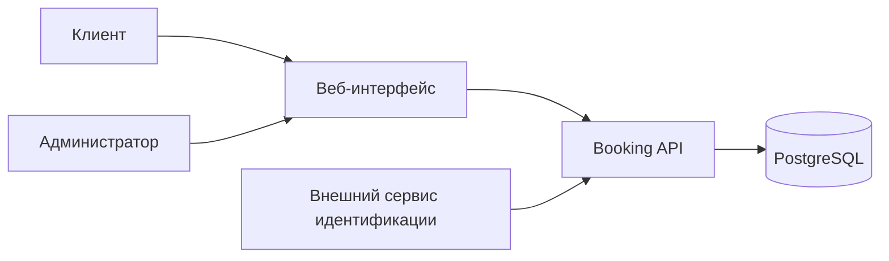

# Slotly — система онлайн-записи на услуги

**Учебный проект для портфолио Junior системного аналитика.**

Кейс небольшой студии: клиент выбирает услугу и свободное время, получает подтверждение и может отменить запись. Главный вопрос проекта — как гарантировать, что один слот не достанется двум клиентам, даже если они нажали «Записаться» одновременно.

Это проектирование системы, а не работающий сервис и не коммерческое внедрение. Заказчик, процессы и ограничения смоделированы; интервью и измерения в реальной компании не проводились. Численные цели ниже — предложения для обсуждения, не достигнутые результаты.

## Посмотреть за 5 минут

1. [Задача, границы и заинтересованные стороны](docs/01-business-context.md).
2. [Требования и правила](docs/02-requirements.md) → [сценарии использования](docs/03-use-cases.md).
3. [Процессы, UML и состояния](docs/04-processes-and-uml.md).
4. [Модель данных](docs/05-data-model.md) → [контракт API](api/openapi.json).
5. [Приёмка и трассировка](docs/07-acceptance.md): от бизнес-цели до конкретной проверки.

## Что показывает проект

| Навык | Артефакт |
|---|---|
| Постановка задачи и управление границами | Контекст, MVP, допущения, вопросы заказчику |
| Формализация требований | FR/NFR, бизнес-правила, роли и права |
| Моделирование процессов | AS-IS / TO-BE, редактируемая BPMN 2.0 |
| Описание взаимодействия систем | UML sequence, REST API, ошибки и идемпотентность |
| Проектирование данных | ER-диаграмма, словарь, PostgreSQL DDL |
| Проверяемость требований | Критерии приёмки, негативные и граничные сценарии |
| Обоснование решений | ADR о слотах и защите от двойной записи |



## Состав репозитория

```text
docs/       Контекст, требования, сценарии, модели, API-пояснения, приёмка
diagrams/   BPMN 2.0 с координатами для редактора
api/        OpenAPI 3.0.3 в JSON и примеры HTTP-запросов
database/   PostgreSQL DDL и запросы аналитика
decisions/  Обоснование ключевого проектного решения
tools/      Проверка внутренних ссылок и структуры API
```

## Как изучать и проверять

- Документы и Mermaid-диаграммы читаются прямо в GitHub.
- `diagrams/booking.bpmn` можно открыть в редакторе BPMN 2.0. Это процесс оркестрации запроса, не исполняемая конфигурация движка.
- `api/openapi.json` можно импортировать в Swagger Editor или Postman. Адрес `https://api.slotly.example/v1` — демонстрационный, сервер не развёрнут.
- `database/schema.sql` описывает модель PostgreSQL; это проект DDL, а не миграция существующей системы.
- Проверка без внешних зависимостей: `node tools/validate.mjs`.
- [Как разместить на GitHub](PUBLISH.md).
- [Как рассказать о проекте на собеседовании](docs/08-interview.md).

## Ключевые решения

MVP использует заранее созданные слоты фиксированной длительности. Один слот связан с одной услугой и одним специалистом. База запрещает пересечение слотов специалиста и более одной активной записи на слот. Отмена освобождает слот в той же транзакции. Повтор успешного запроса с тем же ключом не создаёт дубль.

Подробности и ограничения: [ADR-001](decisions/001-fixed-slots.md). Не входят в MVP: оплата, перенос одним действием, SMS, групповые услуги, управление расписанием через API и регистрация пользователей.

## Статус

Аналитический пакет v1.0. Реализация API, нагрузочные испытания и запуск PostgreSQL не выполнены. Сценарии приёмки описывают ожидаемое поведение будущей реализации. Документы подготовлены с помощью ИИ; перед использованием в портфолио важно самостоятельно разобрать и уметь защитить решения.
