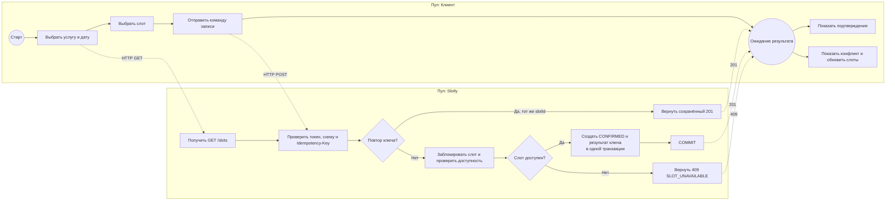
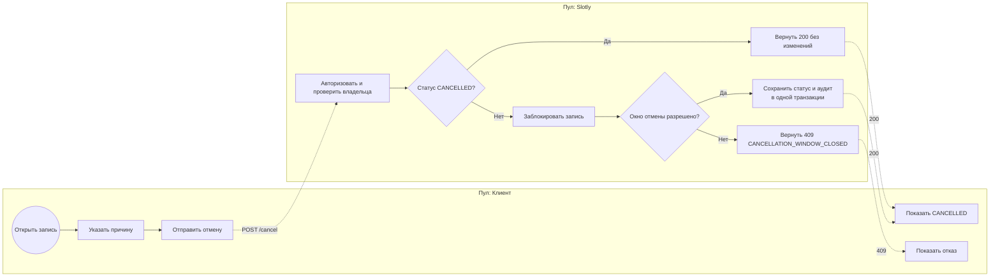

# Бизнес-процессы (BPMN)

Диаграммы показывают TO-BE процесс одной студии. Пулы и дорожки отражают участников, события — результат команды. Для редактирования в BPMN-инструменте используется [booking.bpmn](booking.bpmn); Mermaid ниже даёт быстрый просмотр прямо в GitHub.

## BP-01. Онлайн-запись на свободный слот

## BP-02. Отмена записи

## Правила процесса

- Получение свободных слотов не меняет состояние базы.
- Ветвление «доступен ли слот» выполняется после блокировки и повторной проверки серверного времени.
- При успешной записи фиксируются `appointment` и `idempotency_result`; при отказе изменения откатываются.
- Повтор отмены уже отменённой записи идемпотентен и не создаёт новую запись аудита.
- Администратор использует тот же процесс отмены, но проверяет право `admin` и условие `startsAt > now` вместо двухчасового окна клиента.

## Границы BPMN-модели

Модель описывает orchestration API-команды и не является исполняемой схемой workflow-движка. Регистрация, оплата, уведомления и импорт расписания находятся за границами процесса.
