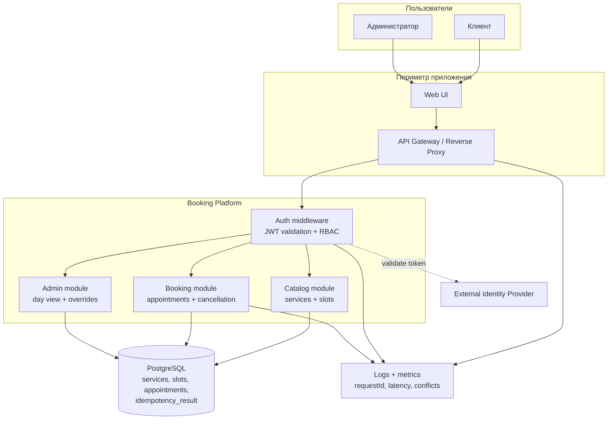

# High-Level Architecture

## Логическое представление MVP

## Ответственность компонентов

| Компонент | Ответственность | Граница MVP |
|---|---|---|
| Web UI | Выбор услуги/даты, отображение слотов, отправка команд, экран конфликта | Внешний интерфейс; бизнес-правила не считаются только на клиенте |
| API Gateway | TLS termination, маршрутизация, ограничение размера запроса, корреляция `requestId` | Конкретный продукт gateway не выбран |
| Auth middleware | Проверка подписи, issuer, audience, срока JWT и роли | Регистрация пользователей и политика IdP вне системы |
| Catalog module | Выдача активных услуг и доступных слотов | Расписание импортируется; редактирование через API отложено |
| Booking module | Транзакция создания/отмены, идемпотентность, серверное время | Уведомления и оплата не входят |
| Admin module | Список дня, административная отмена | Отчёты и управление расписанием отложены |
| PostgreSQL | Транзакции, внешние ключи, exclusion constraint слотов, частичный UNIQUE активной записи | Одна студия и одна зона времени |
| Logs + metrics | Техническая диагностика и измерение NFR | Токены и причины отмены в логах запрещены |

## Ключевые потоки

1. Чтение слотов — синхронный `GET /slots`; оно не создаёт резерв.
2. Создание — синхронный `POST /appointments`; Booking module блокирует слот, повторно проверяет условия, сохраняет запись и результат идемпотентности в одной транзакции.
3. Отмена — синхронная команда; статус записи и аудит причины меняются атомарно.
4. Identity Provider остаётся отдельной доверенной системой. API получает из токена `subject` и роль, а не принимает `clientId` от клиента.

## Нефункциональные границы

- PostgreSQL — единственный источник истины для занятости слота.
- `requestId` проходит через gateway и API; в ответах ошибок он помогает найти запрос в технических журналах.
- При добавлении SMS или фоновых уведомлений нужен отдельный outbox-компонент. В текущем MVP запись не зависит от внешнего провайдера сообщений.
- Масштабирование API горизонтальное, но операции одного слота сериализуются на уровне БД. Параметры нагрузки и SLA приведены в NFR-01 и требуют испытаний.

## Связанные артефакты

- [BPMN бизнес-процесса](business-processes.md) и [редактируемый BPMN 2.0](booking.bpmn).
- [UML Sequence Diagrams](uml-sequence-diagrams.md).
- [Контракт OpenAPI](../api/openapi.json) и [модель данных](../docs/05-data-model.md).
