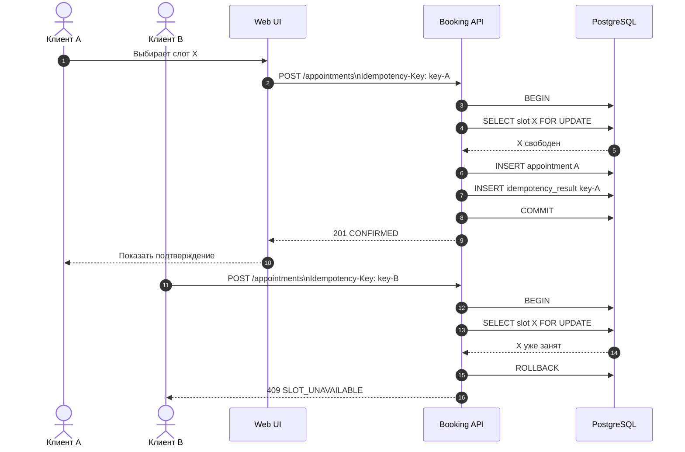
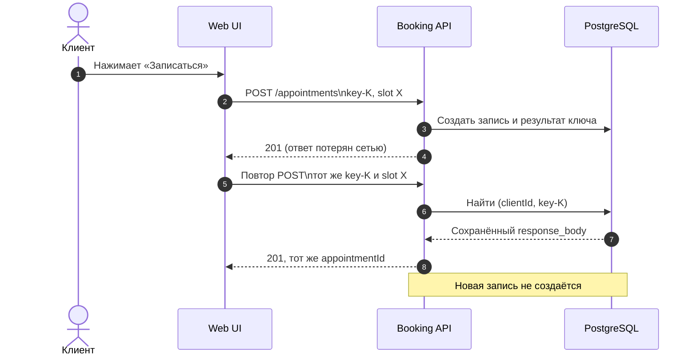
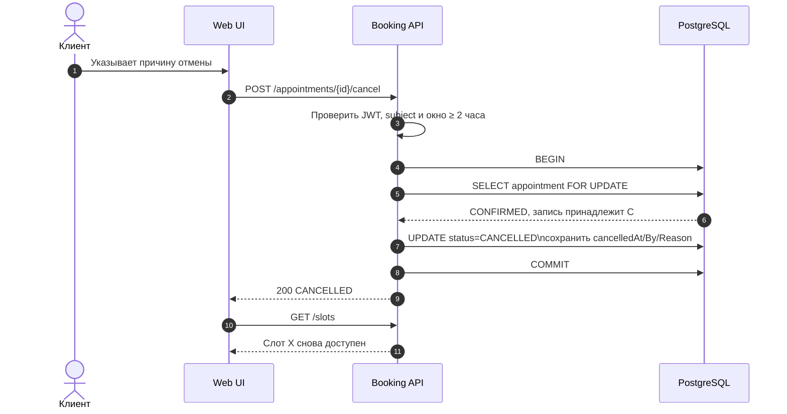
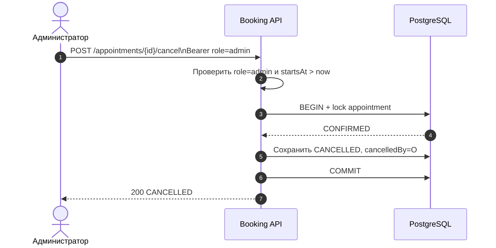

# UML Sequence Diagrams

Диаграммы описывают взаимодействия на уровне API и базы данных. Имена операций соответствуют [OpenAPI-контракту](../api/openapi.json).

## SD-01. Успешное создание записи и конкурентный конфликт

## SD-02. Повтор после потери ответа

Если ключ использован с другим `slotId`, API возвращает 409 `IDEMPOTENCY_KEY_REUSED`. После TTL 24 часа прежний ключ может быть обработан заново.

## SD-03. Отмена клиентом и освобождение слота

Если запись уже `CANCELLED`, API возвращает 200 с сохранёнными данными без изменения первоначальной причины. Если до начала менее двух часов, транзакция не изменяет запись и возвращается 409.

## SD-04. Административная отмена

## Соглашения

- `201` возвращается только после commit.
- `409` сообщает бизнес-конфликт и не раскрывает SQL-детали.
- `404` для чужой записи скрывает факт существования объекта.
- Серверное время и состояние после блокировки являются источниками решения; состояние, показанное в UI до POST, может устареть.
