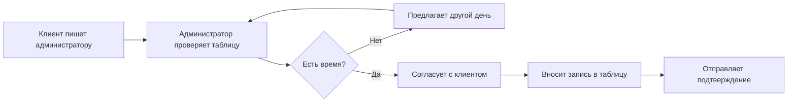
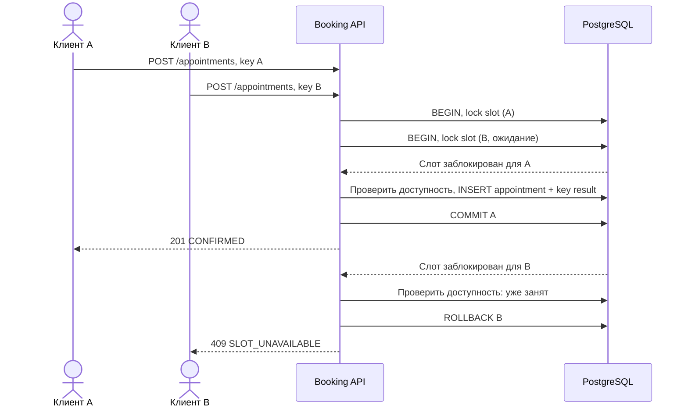
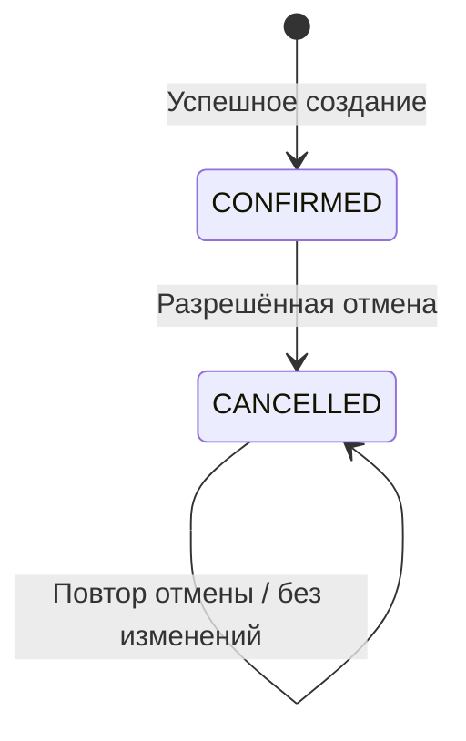

# 04. Процессы и UML

## AS-IS: гипотеза текущего процесса

Риск возникает между проверкой и внесением записи: другой канал может занять время. Процесс AS-IS — исходная модель для проектирования TO-BE.

## TO-BE

Выбор услуги и времени предшествует отправке команды бронирования. Получение слотов не резервирует их. Окончательное решение принимает транзакция создания.

[BPMN 2.0: обработка команды бронирования](../diagrams/booking.bpmn) — редактируемый файл с графическим слоем BPMNDI. В нём одна системная дорожка: приём команды, проверки, исключающий шлюз, результат. Отрицательный результат включает недоступный слот, невалидный запрос и отказ доступа. Алгоритм обработки повторного ключа раскрыт ниже. Процесс не предназначен для запуска в BPMN-движке.

## UML sequence: конкурентная запись

Частичный UNIQUE в БД остаётся последней защитой, даже если разработчик пропустит блокировку. При конфликте уникальности API преобразует ошибку ограничения в 409; SQL и stack trace клиенту не передаются.

## UML state: жизненный цикл записи

CONFIRMED означает неотменённую запись, включая прошлую. Учет факта посещения вне MVP: автоматически переводить в COMPLETED нельзя. CANCELLED терминален относительно бизнес-изменений; стрелка на себя означает чтение результата.

## Алгоритм создания и идемпотентности

1. Проверить токен client, заголовок UUID и тело; при ошибке вернуть 401/403/422.
2. Начать транзакцию READ COMMITTED. Сериализовать операции по паре `(clientId, key)` транзакционной блокировкой (например, advisory lock от хеша пары; коллизия лишь замедлит обработку).
3. Найти неистёкший результат. При том же slotId вернуть сохранённые статус/тело; при другом — 409. Проверка повтора предшествует проверке текущей доступности.
4. Если результат истёк, удалить его в этой же транзакции. После 24 часов ключ допускается повторно; клиент не должен рассчитывать на бессрочный повтор.
5. Заблокировать слот `SELECT ... FOR UPDATE`; повторно проверить публикацию, активность услуги, время, горизонт и отсутствие CONFIRMED.
6. Вставить запись с clientId из токена и `source = WEB`; вставить запись ключа с исходным ответом 201, `expiresAt = createdAt + 24h`.
7. Commit; только затем вернуть 201. Неуспешные ответы не кэшируются. Повтор неуспешного запроса может позднее завершиться успешно.

Если исходная запись уже отменена, повтор создания в пределах TTL возвращает исходное тело CONFIRMED. Текущее состояние следует читать через GET. Это намеренная семантика воспроизведения ответа.

## Согласованность отмены и создания

Отмена блокирует строку записи. Новое создание блокирует слот и проверяет активную запись. До commit отмены возможен 409; после commit новый запрос может создать запись. Это допустимо: список слотов — снимок. Успешная отмена никогда не позволяет двум CONFIRMED существовать одновременно. Проверки времени выполняются после получения блокировки по свежему серверному времени, а не времени начала ожидающей транзакции.
