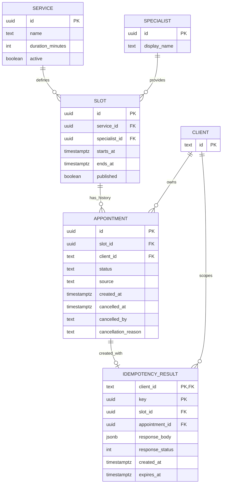

# 05. Данные

## Словарь и ограничения

| Объект | Семантика и валидация |
|---|---|
| service | Название 1–120 символов; duration_minutes 15–240; active управляет каталогом и новыми записями |
| specialist | Публичное отображаемое имя 1–120 символов; персональные контакты не нужны |
| slot | ends_at > starts_at; временной интервал специалиста не пересекается с другим, включая неопубликованные слоты |
| client | id — стабильный subject IdP, 1–200 символов; создаётся при первом запросе записи, email не хранится |
| appointment | CONFIRMED или CANCELLED; `source=WEB` в MVP; cancelled_* заполнены совместно только для CANCELLED |
| cancelled_by | subject актора, включая администратора; FK на client нет, потому что администратор не обязательно клиент |
| cancellation_reason | После trim 1–500 символов; возвращается владельцу/администратору, не пишется в логи |
| idempotency_result | Ключ уникален в области клиента; исходный ответ 201 хранится 24 часа и удаляется фоново или при повторном использовании |

Один слот имеет много исторических записей, но не более одной CONFIRMED. Поэтому обычный UNIQUE(slot_id) неверен: он запретил бы запись после отмены. Используется частичный уникальный индекс.

## Что обеспечивает БД, а что приложение

**БД:** PK/FK; допустимые статусы; согласованность полей отмены; непересечение слотов специалиста; одна CONFIRMED на слот; уникальность пары client/key.

**API:** права; срок отмены; горизонт; неизменность чужих записей; серверное время; source; воспроизведение ответа по ключу; сортировка.

**Импорт:** длительность слота = длительности услуги, корректная зона исходного расписания; запрет изменения времени, специалиста и услуги слота после появления любой записи. Каталог и расписание в этом MVP после загрузки не меняются через API.

DDL находится в [schema.sql](../database/schema.sql), примеры расследования и отчёта — в [queries.sql](../database/queries.sql). SQL требует PostgreSQL с расширением `btree_gist`. DDL не содержит персональных данных и не выполнялся против рабочей БД.

## Время

Пример `2026-09-10T10:00:00+04:00` и `2026-09-10T06:00:00Z` — один момент. Фильтрация даты использует границы локального дня в Europe/Saratov: начало включено, начало следующего дня исключено. Нельзя фильтровать по UTC-дате без перевода зоны.

## Жизненный цикл данных

Записи не удаляются при отмене. Результаты ключей имеют технический TTL 24 часа. Долговременное хранение записей и причин отмены требует отдельного решения владельца; до него запуск с реальными пользователями не планируется. Контакты и пароли отсутствуют в модели.
